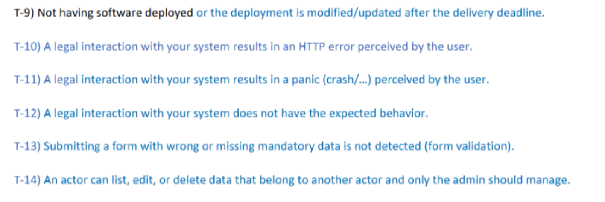

# **Protocolo de Revisión y Validación: Usuarios piloto**

  
    

        
    

---

## Información General

**Proyecto:** AURA  
**Grupo (EV):** 4  
**Nombre del grupo:** AURA  

**Tipo de documento:** Documento adicional de análisis  
**Entrega:** S3  
**Versión:** v1.0 
**Fecha:** 14/04/2026  

---

Debido al requisito de contar con un mínimo de dos revisores por sección, se ha procedido a organizar al equipo de usuarios piloto (compuesto por seis integrantes) en dos grupos de tres personas. Cada grupo asumirá la responsabilidad de revisar una app distinta. 

## 1. Metodología de Revisión 
Cada miembro deberá realizar una revisión integral de los casos de uso asignados bajo las siguientes premisas: 

- Duración: La sesión de revisión tendrá una duración estricta de entre 50 y 60 minutos. 

- Alcance: Se espera una validación completa de las funcionalidades y la recopilación detallada de impresiones, cada usuario obtendrá feedback de todos los casos de uso especificados en su documento. 

--- 

## 2. Registro de Hallazgos y Control de Tiempos 
Para centralizar la información, se habilitará un documento por cada grupo de revisión con la siguiente estructura: 

- Control de horas: Una tabla donde cada miembro registrará el tiempo efectivo dedicado. 

- Registro de Feedback: Un listado de los casos de uso donde cada revisor deberá apuntar su nombre y sus observaciones en tiempo real. 

- Objetivo de densidad: Al finalizar, cada caso de uso debe contar con el análisis exhaustivo de tres miembros distintos. 

---
 
## 3. Criterios de Evaluación 
El análisis no debe limitarse a la superficie; se requiere un enfoque detallado que abarque: 

- Operatividad y errores: Identificación de fallos funcionales o bugs. 

- UX/UI: Valoración de la interfaz y usabilidad. 

- Propuestas de mejora: Sugerencias para optimizar el sistema. 

**!IMPORTANTE** Nota Obligatoria: Es obligatorio identificar errores críticos o vulnerabilidades de alto impacto en las aplicaciones. La ausencia de hallazgos relevantes será motivo de penalización, por lo que se requiere un análisis exhaustivo y riguroso. Aqui abajo las condiciones de fallo que de no encontrarse durante la revisión tendrá un impacto importante en la nota.

  
    

        
    

Finalmente, además de completar el documento de seguimiento, se deberá realizar un formulario posterior (se encargará el secretario, es un formulario en conjunto) y si los grupos requieren de otras formas para recibir feedback, como por ejemplo un cuestionario propio, se tendra que realizar individualmente. 