# **Recogida de Feedback de Donde Siempre**

  
    

        
    

---

## Información General

**Proyecto:** AURA  
**Grupo (EV):** 4  
**Nombre del grupo:** AURA  

**Tipo de documento:** Documento adicional de análisis  
**Entrega:** S3  
**Versión:** v1.0 
**Fecha:** 14/04/2026  

---

**Horas Trabajadas por Miembro:**
* **Mario:** 01:01:34
* **Rafa:** 00:57:53
* **Alberto:** 00:58:54

---

## **Listado casos de uso** 

## 1. Como tienda:  

### Abrir mapa de tiendas para ver tiendas alrededor 

**Mario:** 
- Aunque se establece como requisito tener la ubicación activada, al no aceptar este permiso, la pantalla inicial no lanza ningún mensaje de advertencia. 
- El sistema no gestiona correctamente la denegación de permisos ni guía al usuario explicándole que debe activarlos. Esto es un fallo grave de usabilidad y diseño (T-12: Comportamiento no esperado). Sale por defecto Dos hermanas, sin ver ninguna advertencia de necesidad de localización  

  
    

        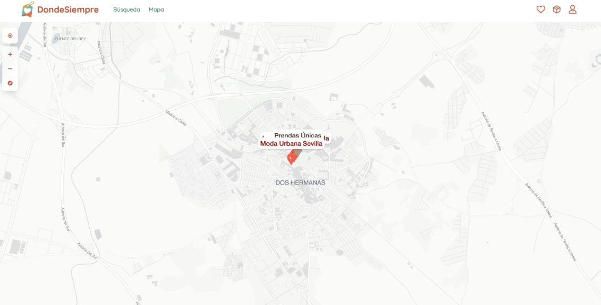
    

**Rafa:** 
- El mapa funciona correctamente, pero parece que solo funcionan los botones de zoom. Los botones de centrarte en la pantalla y cambiar la orientación del mapa no funcionan. Lo de que el mapa no tenga color me chirria un poco, pero le da su toque de simplicidad 

**Alberto:**
- El mapa se abre correctamente al aceptarle la petición la ubicación y te deja navegar por él, aunque no te deja girarlo por mucho que le des al botón. 

---

### Poder ver las colecciones y outfits de las tiendas 

**Mario:** 
- El interruptor de "Mostrar colecciones antes que outfits" no funciona. Si lo apagas, guardas y recargas la página para que se apliquen los cambios (como dice el manual), no hace absolutamente nada. El botón se vuelve a encender solo, no guarda tu configuración y el orden del escaparate sigue siendo exactamente el mismo. Es un fallo claro ya que el botón no tiene el comportamiento esperado (T-12). 

**Rafa:** 
- Las colecciones no se pueden clickear, no sé si eso es correcto. Está muy bien que sea scroleable horizontalmente 

**Alberto:** 
- Se muestra el escaparte de la tienda con las fechas de apertura y cierre, las colecciones y los outfits. También muestra un poco de información sobre la tienda. Algunas fotos no cargan. Las colecciones se muestran bien, aunque no puedes hacer nada con ellas aparte de ver cuales hay. 

  
    

        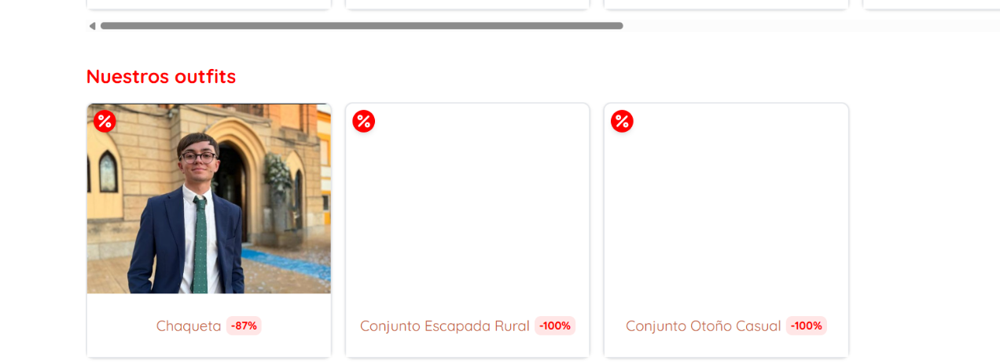
    

--- 

### Como tienda puede añadir, eliminar y modificar outfits 

**Mario:** 

- Al crear un outfit, si le das x veces seguidas al botón de "Crear" mientras la pantalla está cargando, la app no bloquea el botón y te crea tantos outfits iguales como clics hayas dado. He acabado con la lista llena de duplicados del mismo conjunto solo por pulsar el botón rápido. Es un comportamiento no esperado y ensucia toda la base de datos (T-12). 

  
    

        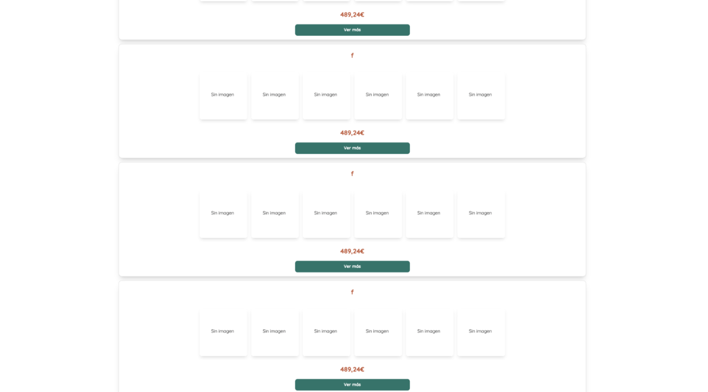
    

 
- He detectado que los precios no tienen sentido al crear un outfit. He añadido un "Vestido Lencero" que en la lista de abajo pone que cuesta 118,73€. En cuanto le doy a añadir, en la tarjetita del outfit me sale con un precio de 125,00€, pero luego el total de abajo vuelve a decir que son 118,73€. Es un lío porque el usuario no sabe cuánto cuesta de verdad el producto. Es un fallo de comportamiento (T-12). 

  
    

        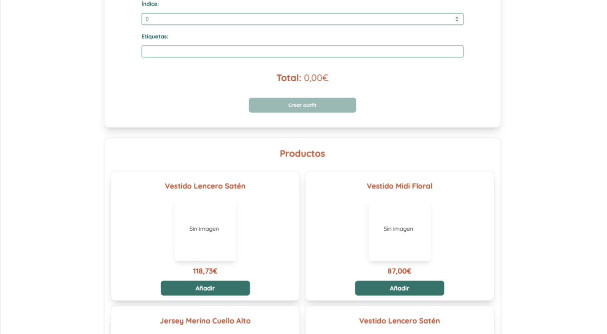
    

  
    

        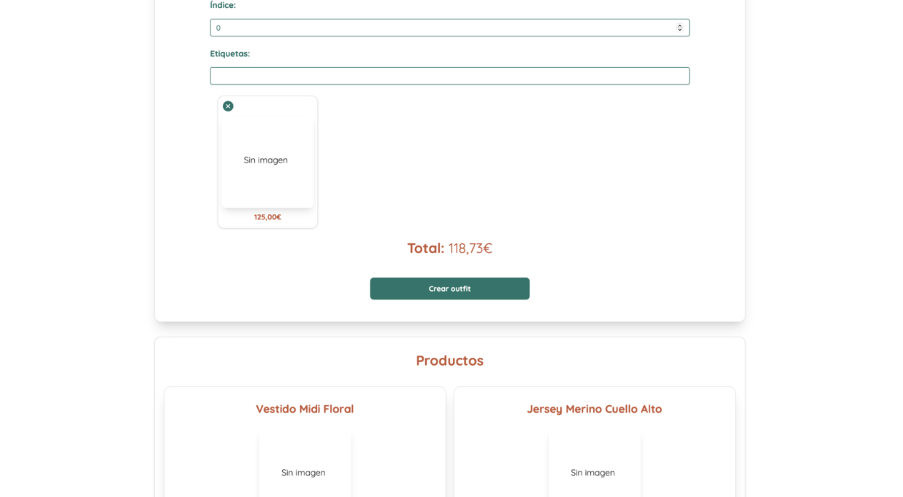
    

- Al editar el porcentaje de descuento, no se actualiza en la esquina del resumen del outfit, siempre sale -100%

  
    

        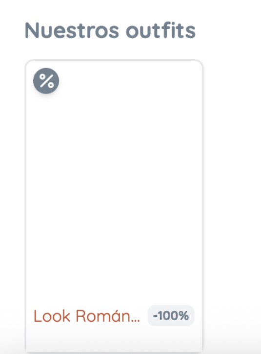
    

**Rafa:**   

- Al crear un outfit, si quieres poner etiquetas no te deja usar el espacio. 

- Al crear un outfit e introducir una foto, no carga luego la foto, pone sin imagen 

- El nombre tiene límite de 36 caracteres, no sé si es correcto 

- En la descripción de un outfit puedes poner más de 256 caracteres 

- En el precio rebajado y el índice de un outfit he puesto 100000000000000000000000000000000000000000000 y no me deja crearlo, pero tampoco me muestra ninguna restricción por pantalla. Si abro la consola me sale error 500 

- En las etiquetas si le das al espacio directamente sale 500 por consola 

- Una etiqueta con 254 caracteres hace que la pantalla se extienda por la derecha 

- Las etiquetas con 254 caracteres no deja eliminarlas 

- Los outfits nuevos creados tardan mucho en salir en nuestros outfits 

- Las etiquetas no salen en ningún lado 

- Una vez pones una foto no puedes quitarla, solo sustituirla 

- Se puede poner el precio rebajado por encima del precio actual y al hacerlo el porcentaje de rebaja que se ve en el escaparate sale mal (sale con doble negación) 

 

**Alberto:**  
- Se pueden crear, modificar y eliminar outfits. Cambiaría el botón de “Modo tienda” para que fuera más visible. Cualquiera puede hacer lo que quiera con todas las tiendas y todos los outfits, eso es un error gravísimo. 

- Te deja poner índice 0 en un outfit. Si te vas a “Ver más” en la sección de outfits y le das al botón “Editar” de un outfit, te lleva a los detalles de un outfit y no a la pantalla de editar. 

- Para poner un precio rebajado tienes que irte a la edición del outfit y no lo puedes poner directamente en la creación. 

 
### Compartir promoción 

**Mario:**  

- Al compartir una promoción, sale siempre la misma imagen, sin importar el descuento que se aplique. Siempre sale –100% 

  
    

        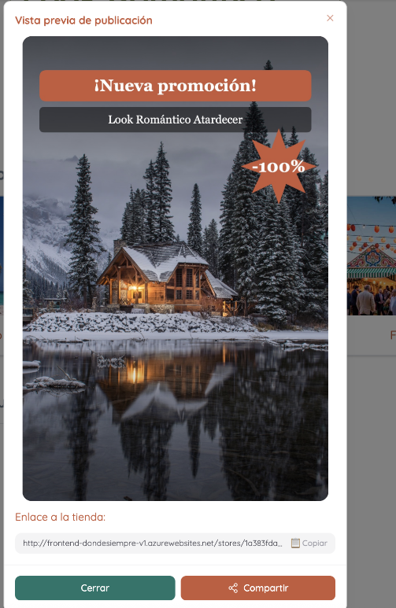
    

- Aunque en las guías se recomienda usar el móvil para subir promociones, al darle a compartir desde el ordenador, el botón no está bien integrado y solo abre el menú básico del sistema en lugar de dar opciones específicas de redes sociales como Instagram (como prometían). 

  
    

        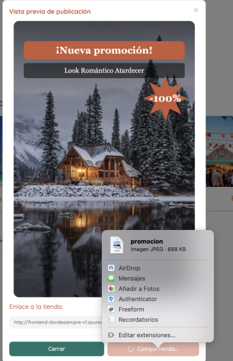
    

**Alberto:**  
- Te genera una imagen de una promoción y te deja compartirla de varias maneras. Esta funcionalidad parece que está bien hecha. 

**Rafa:**  
- La funcionalidad de poder compartirlo desde el ordenador es un tanto curiosa, se abre un panel muy básico para compartir, creo que no es lo esperado 

 

### Editar datos de tienda 

**Mario:** 

- No es posible editar el contenido de la tienda: nombre, dirección, horarios, url... 

- En general está bastante bien la interfaz, pero a la hora de anunciar las promociones buscaría algo más visual y que llame más la atención, una pequeña foto del outfit? 

**Alberto:**  
- Parece que está bien la interfaz, aunque tiene algunos fallos. Para cambiar los colores de un escaparate hay que recargar para ver el cambio. Para ver el cambio de orden entre colecciones y outfits también hay que recargar. 
- Si pones una ruta de acceso de una foto propia para la foto de portada de una tienda y le das a “Guardar cambios” te sale el siguiente error. 

  
    

        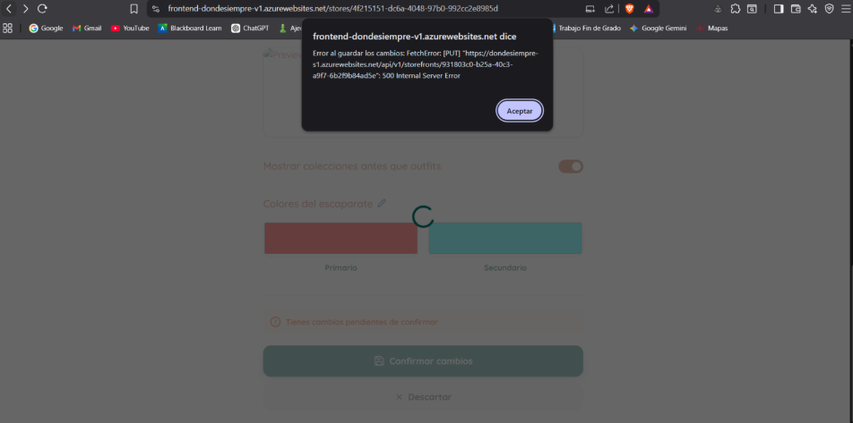
    

 **Rafa:**  

- Al cambiar el color de un escaparate no ha funcionado hasta que lo he hecho otra vez. Tienes que refrescar la pestaña para que se vea el cambio. 

- La opción de hacer que los outfits se vean antes que las categorías pasan lo mismo que con los colores, hay que refrescar para que se aplique el cambio 

- Se puede cambiar la imagen de cabecera de la tienda con una url invalida 

 

 

## 2. Como cliente: 

### Abrir mapa de tiendas para ver tiendas alrededor 

Mario: 

- Al hacer uso del mapa, si me alejo de mi ubicación arrastrando el mapa, el botón para volver a ella no funciona. En la barra lateral, únicamente funciona el zoom. 

 

**Rafa:**   

- Los botones para localizarte en el mapa no funcionan, el botón que te pone en el centro del mapa me refiero 

- Pulsar en el banner y en mapa te llevan al mismo sitio, no sé si eso es correcto 

 

**Alberto:**  
- El mapa me ha funcionado bastante bien y he podido ver las tiendas. Foto tienda “Moda Urbana” no carga. Botón búsqueda lleva a una página vacía (Estamos en construcción). 
- Botón del monigote y del paquete también te llevan a la misma página vacía. 

  
    

        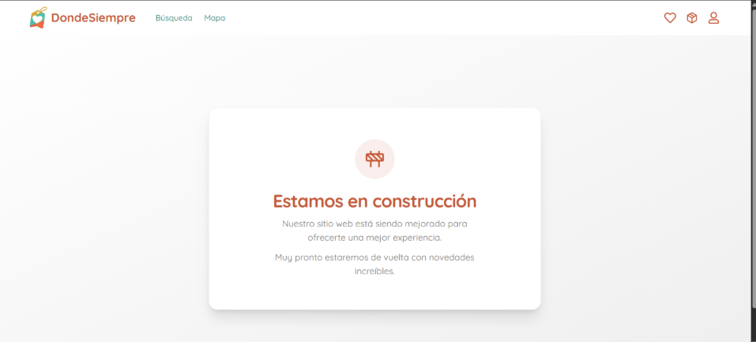
    

### Poder ver las colecciones y outfits de las tiendas 

**Alberto:**  
- Se pueden ver las colecciones y los outfits de las tiendas. Clicar en una colección no hace nada. 

- Algunas fotos de los outfits no cargan. 

- El botón “Ver más” en “Nuestras colecciones” te lleva a la misma página vacía. 

- Las etiquetas de los outfits no se ven en ningún lado como cliente. 

- Debería haber botones para volver a la página anterior. 

**Mario:** 
- El escaparate de algunas tiendas en poco visible. Cuidar el uso de colores 

  
    

        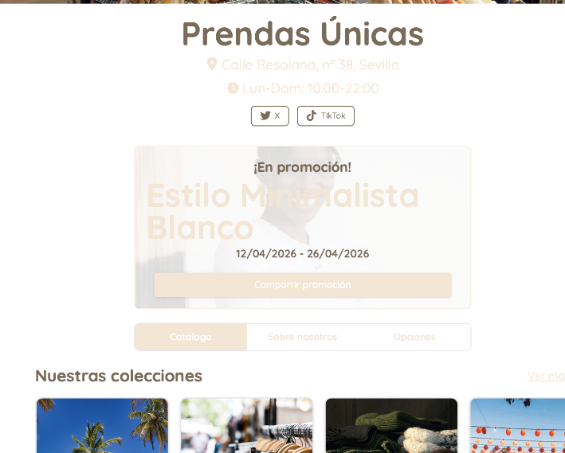
    

**Rafa:**  
- Las colecciones no se pueden clickear, no sé si eso es correcto. Esta muy bien que sea scroleable horizontalmente 

 
### Como cliente puedo ver detalles de los conjuntos y añadirlos al carrito 

Mario: 
- No funciona botón Añadir carrito 

**Alberto:**  
- Se pueden ver los detalles de los outfits. 

- Las fotos de los productos no cargan. 

- Me ha salido el siguiente error cuando he clicado en un outfit (me ha salido varias veces).  

  
    

        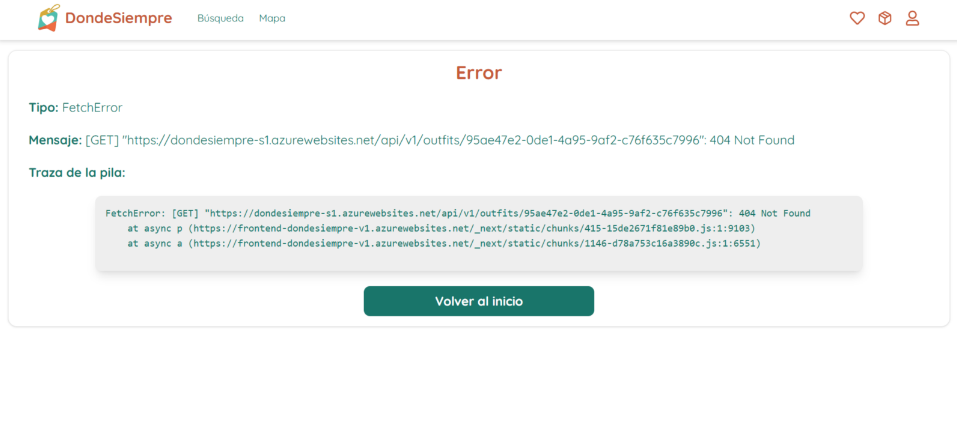
    

- Botón “Añadir al carrito” no hace nada. 

**Rafa:**  
- El botón de añadir al carrito no funciona 

### Seguir tiendas y recibir notificaciones 

**Alberto:**
- Funciona bien darle al botón de seguir a las tiendas y que aparezcan en la sección de las tiendas que sigues. 

- Botón “Dejar de seguir” unas veces no hace nada y otras sí. 

**Rafa:**  
- Tarda demasiado en dejar de seguir una tienda desde la lista de tiendas que sigues. 

- Me ha dejado quitar una y no me deja mas 

**Mario:** 
- Desde el catálogo de tiendas, no funcionan los botones de dejar se seguir 

  
    

        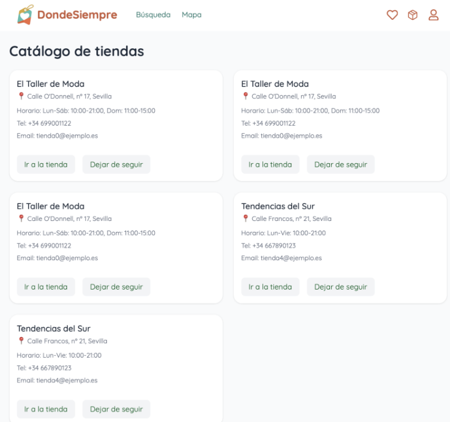
    

