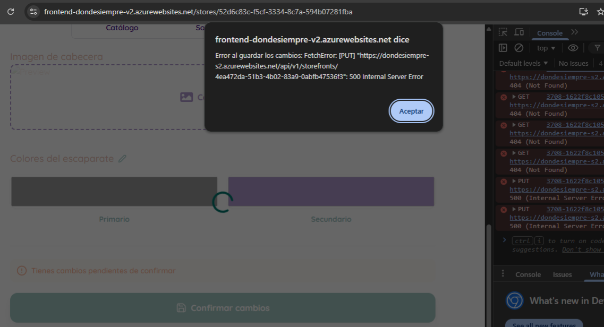
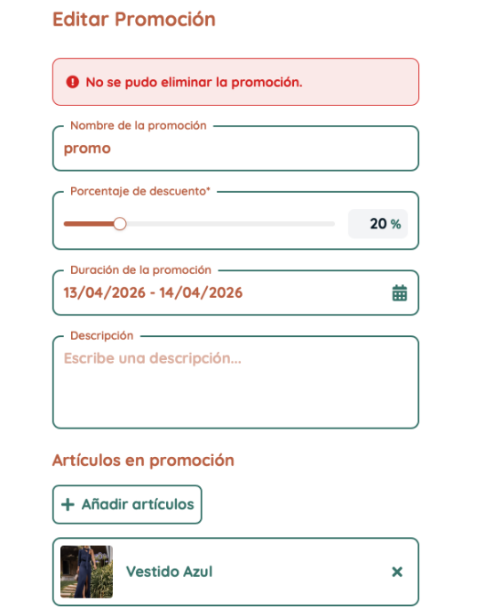
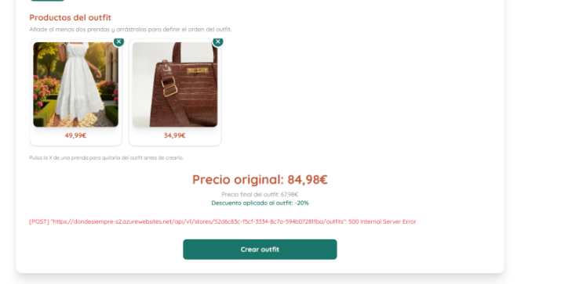
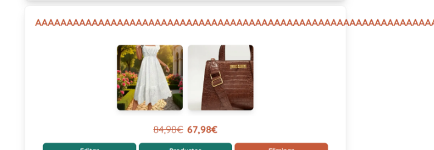

# **Recogida de Feedback de Testers**

  
    

        
    

---

## Información General

**Proyecto:** Donde Siempre  
**Grupo:** -  
**Nombre del grupo:** -  

**Tipo de documento:** Documento adicional de análisis / Recogida de feedback  
**Fecha:** 14/04/2026  

**Horas Trabajadas por Miembro:**
* **Mario:** 1:00:00
* **Alberto:** 1:00:00
* **Rafa:** No especificado

---

## **Listado casos de uso**  

## Map 

### Gestión de Ubicación y Mapa

**Mario:** 
- He realizado pruebas de estrés cambiando mi ubicación para forzar un desbordamiento en el cálculo de distancias. El sistema ha respondido perfectamente, manteniendo la estabilidad y calculando las distancias lejanas correctamente sin sufrir ningún fallo. 

**Rafa:** 
- Al igual que en el anterior sprint, aunque se establece como requisito tener la ubicación activada, al no aceptar este permiso, la pantalla inicial no lanza ningún mensaje de advertencia. El sistema no gestiona correctamente la denegación de permisos ni guía al usuario explicándole que debe activarlos. Esto es un fallo grave de usabilidad y diseño (T-12: Comportamiento no esperado). 
- Sale por defecto Dos hermanas, sin ver ninguna advertencia de necesidad de localización. 
- Al aceptar inicialmente la ubicación y posteriormente quitar los permisos desde los ajustes del navegador, la aplicación ignora el cambio y no reacciona. Al recargar la página con los permisos denegados, el mapa carga por defecto en "Dos Hermanas" como comenté en el primer error (T-12). 
- A la hora de aceptar o denegar los permisos de ubicación, ha tardado bastante en aceptarse, he tenido que refrescar la pagina de hecho, no se si es problema mio. 
- Es facil perderse en el mapa al ser tan blanco, minimalista y con pocos detalles, al no verse colores me pierdo un poco ya que no se donde estoy y los nombres de los sitios se ven muy poco. 
- En cuanto a la ruta desde mi ubicación hasta el negocio seleccionado funciona correctamente. 
- Para ver mi ubicación basta con pulsar el botón del mapa, esto funciona correctamente solo que me sigo perdiendo sin colores. 

 

## Stores 

### Listado y Búsqueda de Tiendas

**Mario:** 
- He intentado forzar un error manipulando la URL para acceder a un escaparate con un ID inválido. El sistema lo gestiona correctamente mostrando una pantalla controlada de "Tienda no encontrada", evitando un crash del servidor. 
- He probado el listado de tiendas simulando la pérdida de la señal GPS (Location unavailable) desde las herramientas de desarrollo. El sistema falla de forma silenciosa: carga el listado de tiendas pero ignora por completo el requisito de ordenarlas por distancia al usuario. No muestra ningún mensaje de advertencia informando de que falta la ubicación, y las tarjetas de las tiendas ni siquiera muestran los kilómetros de distancia para que el cliente pueda comprobarlo. Es un fallo grave de feedback al usuario e incumple el caso de uso principal (T-12: Comportamiento no esperado). 

**Alberto:** 
- La funcionalidad está bastante bien, funciona perfectamente lo de la distancia si tienes la ubicación activada. 
- Si no la tienes el sistema no muestra la distancia, pero si le das a 'Cómo llegar' te sigue llevando a Google Maps aunque no sabe la ubicación (Google Maps sí la sabe). 
- Si no estoy registrado me deja ver el listado de las tiendas y los outfits de éstas. 
- He quitado y vuelto el permiso para mi ubicación y la distancia a las tiendas ha cambiado, lo que me hace pensar que no se calcula correctamente. 

 

## Following 

### Seguimiento de Tiendas (Favoritos)

**Alberto:** 
- He intentado acceder a la página de las tiendas que sigo sin haberme registrado y me manda a la página de inicio de sesión. Si lo hago registrado como una tienda me manda al mapa. 
- La funcionalidad parece ir perfectamente, me deja seguir y dejar de seguir las tiendas y me deja ver el listado. 

**Rafa:** 
- Al seguir una tienda, si vas a los favoritos luego tarda un poco en refrescarse la pagina y salir la nueva tienda en favoritos, pero no creo que tenga importacia. 
- Si intentas acceder a la url de favoritos desde una cuenta de store o sin registrar, no se puede acceder, esto funciona correctamente. 

 

## Storefronts 

### Configuración del Escaparate de Tienda

**Rafa:** 
- He realizado pruebas de validación en el formulario de edición de la información de la tienda. Al introducir datos completamente inválidos, concretamente un "25" en el campo de los horarios (una hora inexistente), el sistema me ha permitido guardar los cambios sin rechistar. No se realiza ninguna validación de formato ni salta ninguna alerta indicando que los datos son erróneos. Este es un fallo directo en el control de entrada de datos (T-13). 
- He realizado pruebas de validación en la configuración de las redes sociales y métodos de contacto de la tienda. El formulario permite introducir cadenas de texto aleatorias (ej. "etcomplementos" o letras sueltas) en lugar de URLs válidas, mostrando un mensaje de éxito al guardar (T-13). Como consecuencia directa de este fallo, cuando un cliente visita el escaparate e intenta acceder a esas redes (por ejemplo, haciendo clic en el icono de TikTok), la aplicación interpreta ese texto sin formato como una ruta interna. Esto provoca que el cliente sea redirigido a una pantalla de error de "Tienda no encontrada", rompiendo por completo la navegación y el caso de uso de contactar con la tienda (T-12). 
- La informacion del escaparate de la tienda se ve a la perfeccion, aunque dejo caer la posibilidad de añadir algo en los horarios para los dias festivos. Se ve correcta la informacion "sobre nosotros" y funciona bien. 
- Los outfits se ven correctamente desde cualquier cuenta, incluso sin registrar. 
- Se puede modificar los enlaces a las redes sociales con texto sin sentido. El numero por ejemplo se puede poner sin formato, en negativo o incluso letras. Sin embargo, en la informacion de la tienda si hay restricciones para el telefono. 
- No puedo añadir otra red social que no sea las que estan definidas. "Selecciona una red social" es una opcion en el desplegable al elegir que red social añadir, tendria mas sentido si fuera el titulo del formulario, no una opcion tambien. No deja crearlo con esa opcion, eso si es correcto. 
- Al editar la tienda, el formulario no cabe completo en la pantalla y no tengo hecho ningun tipo de zoom. 
- Al modificar el banner de la tienda, se puede poner una imagen sin problema, solo que no te da la opcion de recortar la imagen o que parte de ella quieres que encaje en el banner. Estaria bien poner una pantalla donde eliges que parte seleccionar de la foto (como en twitter). 
- Al poner un audio o otro archivo que no es una foto como banner de la tienda, al darle a guardar sale un error 500. 

  
    

        
    

 

## Promotions 

### Creación y Edición de Promociones

**Mario:** 
- Al intentar eliminar una promoción desde la pagina de editar, salta un error. No permite borrarla. (T12). 

  
    

        
    

**Alberto:** 
- T-12) A legal interaction with your system does not have the expected behavior: Le he dado a crear una promoción y no se me ha creado, se ha quedado el botón en 'Cargando...' y he tenido que recargar la página. 
- T-14) An actor can list, edit, or delete data that belongs to another actor and only the admin should manage: Me ha dejado entrar en la pantalla de edición de una promoción sin estar registrado. Dentro de la pantalla de edición me deja modificar los datos, pero al darle a los botones de guardar cambios y eliminar promoción me salen errores. Aunque estos botones están bien manejados, no debería dejarme acceder a la página de edición sin ser la tienda de dicha promoción. Si inicio sesión como otra tienda también me deja acceder a la página pero los botones dan los mismos errores. Si inicio sesión como cliente pasa lo mismo. Como cliente, se ven bien las promociones de las tiendas y los productos a los que se aplican. 

 

## Outfits 

### Gestión de Outfits

**Alberto:** 
- Si subo un archivo que no es una foto a la hora de crear un outfit, sale un error 500 (T-10) A legal interaction with your system results in an HTTP error perceived by the user. 

  
    

        
    

- Si le pongo un nombre con muchos caracteres, el nombre se sale de la tarjeta y tienes que scrollear para verlo entero (T-12) A legal interaction with your system does not have the expected behavior. 

  
    

        
    

**Rafa:** 
- A la hora de actualizar el porcentaje de descuento de un outfit, si lo vuelves a cambiar otra vez y si entras rápido te va a salir el descuento que tenía anteriormente, como que tarda en actualizarse, no puedes acceder para editarlo tan rápido. 
- De nuevo sale error 500 si intentas poner un audio al crear o editar un outfit. 
- Ordenar los outfits funciona correctamente. 
- Una vez se crea un outfit, no se pueden añadir más productos a este si no es desde la pestaña de productos, estaría bien fusionar estas dos vistas, la de editar outfits y editar productos. 
- Los límites para las etiquetas funcionan correctamente, aunque no creo que ninguna etiqueta tenga 255 caracteres. 

 

## Orders 

### Gestión de Ventas y Pedidos

**Mario:** 
- El sistema parece estar diseñado para que sea el cliente quien entregue un código de verificación a la tienda en el momento de la recogida física. Si el cliente pierde ese código o la tienda no puede visualizarlo en su panel de administración, el pedido no puede marcarse como entregado. (T12)
- La pantalla de "Gestión de Ventas" muestra los pedidos, pero los botones de acción (como "Entregar pedido") llevan a una página de búsqueda manual (con código necesario que no tenemos) en lugar de permitir la entrega directa desde la lista. Esto obliga a la tienda a realizar un paso extra innecesario. T12. 
- La pantalla de búsqueda no ofrece ayuda ni guías si el código no se encuentra. 

**Alberto:** 
- Se puede buscar un pedido por código de cliente, pero no te dan en ningún momento el código de los pedidos. El resto de la funcionalidad parece ir correctamente. 

**Rafa:** 
- Si tu te metes como tienda no te deja ver el código de los pedidos, por lo que nunca sabrás si el código que te han dicho es correcto.