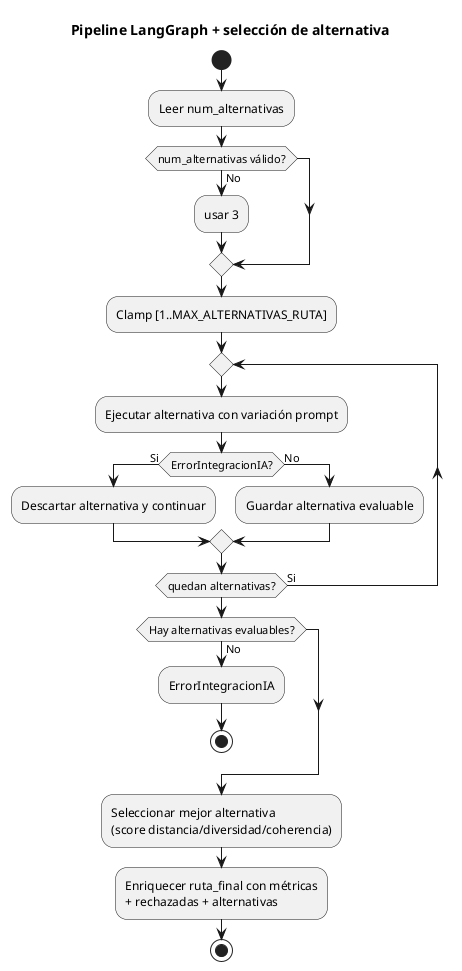
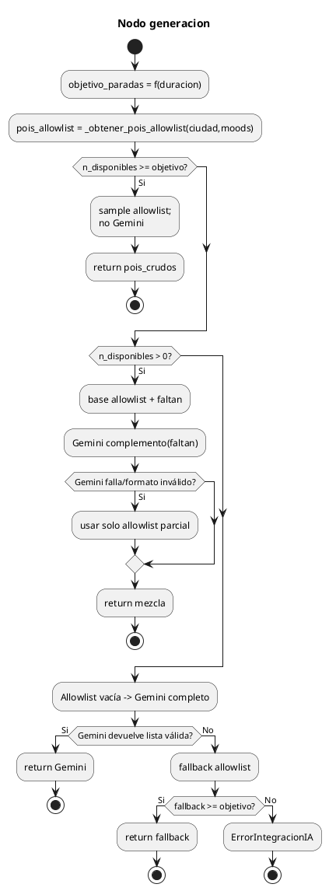
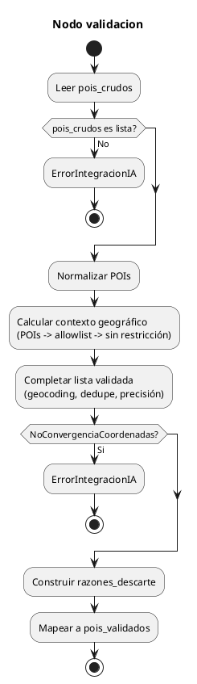
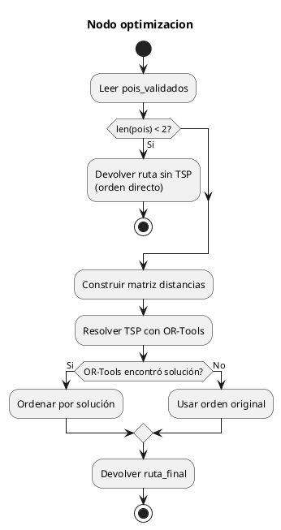
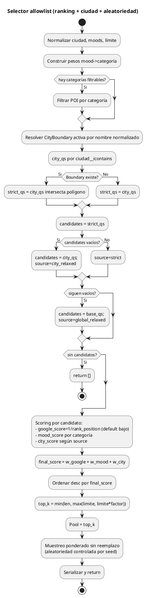

# UML - Generación de Rutas con IA (estado actual)

Este documento refleja el flujo **actual** de generación de rutas IA con sus condicionales principales, según `creacion/views.py`, `creacion/services.py`, `creacion/langgraph/*` y `creacion/allowlist_selector.py`.

## 1) Flujo end-to-end (`POST /generar_ruta_ia`)

```plantuml
@startuml
title Generar ruta IA - Flujo completo

start

if (Usuario autenticado?) then (No)
  :401 ERROR;
  stop
endif

if (Usuario es turista?) then (Si)
  :403 ERROR;
  stop
endif

if (Body JSON válido?) then (No)
  :400 ERROR;
  stop
endif

:Obtener/crear perfil guía;
if (Guía disponible?) then (No)
  :500 ERROR;
  stop
endif

:ensure_ai_generation_allowed();
if (Tier bloquea IA?) then (Si)
  :error tier;
  stop
endif

:apply_payload_tier_rules();
:normalizar_payload_ia();
if (Payload válido? ciudad, duracion, personas,\nexigencia, mood, deseos...) then (No)
  :400 ERROR;
  stop
endif

:ensure_route_people_count_allowed();
if (Tier bloquea personas?) then (Si)
  :error tier;
  stop
endif

:Crear sesión de generación;
:consultar_langgraph(payload);
if (Ruta dict válida?) then (No)
  :400/502/500 ERROR;
  stop
endif

:clamp_generated_stops_to_tier();
:ensure_people+moods de salida;
if (Tier invalida salida IA?) then (Si)
  :error tier;
  stop
endif

:Guardar checkpoint ruta_generada;
:Registrar paradas rechazadas de validación;

if (modo_seleccion = true?) then (Si)
  :record_ai_generation_usage();
  :200 OK\n(ruta propuesta sin guardar);
  stop
else (No)
  :ensure_stop_count/people/moods;
  if (Tier bloquea guardado?) then (Si)
    :error tier;
    stop
  endif

  :guardar_ruta_ia() en BD;
  if (Persistencia válida?) then (No)
    :500 ERROR;
    stop
  endif

  :checkpoint ruta_guardada;
  :guardar_historial_ruta_ia();
  :200 OK\n(ruta guardada);
  stop
endif

@enduml
```

## 2) Pipeline LangGraph (`consultar_langgraph`)

### 2.1 Nodo `generacion`

### 2.2 Nodo `validacion`

### 2.3 Nodo `optimizacion`

## 3) Selector allowlist rankeado (`seleccionar_pois_allowlist`)

