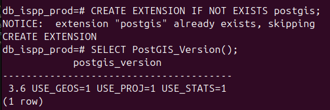
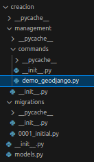
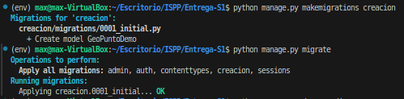
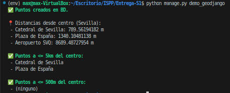
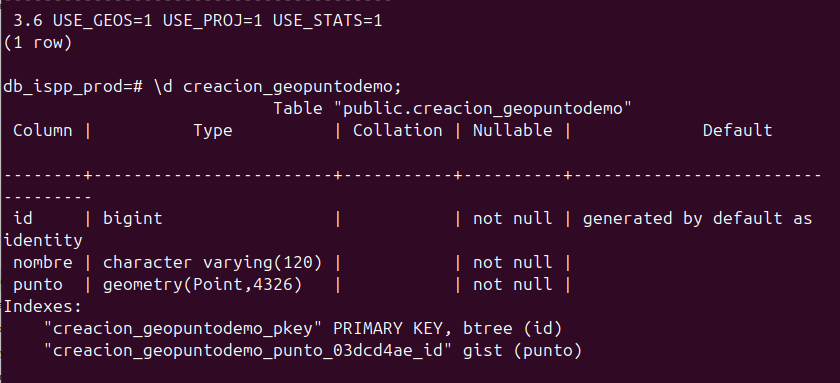
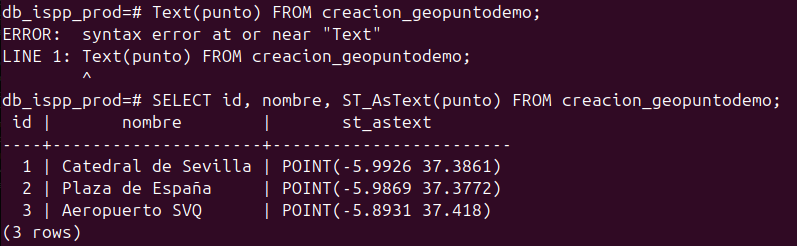
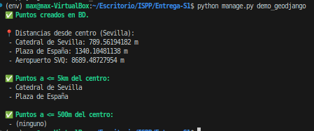

# 🧪 Tarea 6.2 --- Prueba de GeoDjango con PostGIS

**Fecha:** 24/02/2026

------------------------------------------------------------------------

## 📌 Objetivo

Demostrar que el sistema es capaz de:

1.  Guardar coordenadas espaciales en PostgreSQL utilizando `PointField`
    (GeoDjango).
2.  Consultar datos espaciales correctamente (ej. búsqueda por
    distancia).
3.  Validar que PostGIS está correctamente configurado en la base de
    datos Docker.

------------------------------------------------------------------------

# 1️⃣ Configuración del Entorno

## 1.1 Activación del entorno virtual

``` bash
source env/bin/activate
```

------------------------------------------------------------------------

## 1.2 Configuración de Django para PostGIS

En `settings.py` se verificó:

``` python
INSTALLED_APPS = [
    ...
    "django.contrib.gis",
    "creacion",
]
```

``` python
'ENGINE': 'django.contrib.gis.db.backends.postgis'
```

------------------------------------------------------------------------

# 2️⃣ Verificación de PostGIS en Docker

Desde el CLI conectado al contenedor PostgreSQL:

``` sql
CREATE EXTENSION IF NOT EXISTS postgis;
SELECT PostGIS_Version();
```

📸 **Captura 1 -- Verificación de PostGIS en la base de datos**


------------------------------------------------------------------------

# 3️⃣ Creación del Modelo Espacial

Archivo: `creacion/models.py`

``` python
from django.contrib.gis.db import models as gis_models

class GeoPuntoDemo(gis_models.Model):
    nombre = gis_models.CharField(max_length=120)
    punto = gis_models.PointField(srid=4326)

    def __str__(self):
        return self.nombre
```

------------------------------------------------------------------------

# 4️⃣ Creación del Management Command

Estructura:

    creacion/
     └── management/
         └── commands/
             ├── __init__.py
             └── demo_geodjango.py

📸 **Captura 2 -- Estructura de carpetas**


------------------------------------------------------------------------

# 5️⃣ Migraciones

``` bash
python manage.py makemigrations creacion
python manage.py migrate
```

📸 **Captura 3 -- Creación y aplicaciones de migraciones**


------------------------------------------------------------------------

# 6️⃣ Ejecución de la Prueba

``` bash
python manage.py demo_geodjango
```

📸 **Captura 4 -- Resultado ejecución demo_geodjango**


------------------------------------------------------------------------

# 7️⃣ Verificación Directa en PostgreSQL

``` sql
\d creacion_geopuntodemo;
```

``` sql
SELECT id, nombre, ST_AsText(punto) FROM creacion_geopuntodemo;
```

📸 **Captura 5 -- Estructura de la tabla**



📸 **Captura 6 -- Datos almacenados**


------------------------------------------------------------------------

# 8️⃣ Validación Funcional

Se comprobó que:

-   ✅ El campo `PointField` se guarda correctamente.
-   ✅ PostGIS calcula distancias espaciales.
-   ✅ Se pueden realizar consultas geográficas (`distance_lte`).
-   ✅ La integración Django ↔ PostgreSQL ↔ PostGIS funciona
    correctamente.
📸 **Captura 7 -- Verificación con script**

------------------------------------------------------------------------

# 🎯 Conclusión

La prueba demuestra que:

-   El sistema está preparado para almacenar coordenadas reales de
    rutas.
-   Se pueden realizar búsquedas espaciales eficientes.

